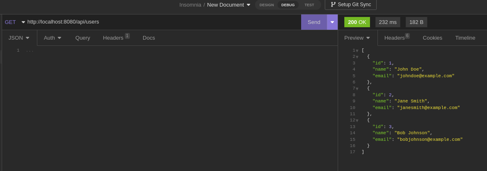

# Backend - prueba técnica

## Capturas de pantalla
### Endpoint (/api/users)

1. Al iniciar la API se precargan 3 registros, estos registros están definidos en el archivo "src/main/resources/data.sql"

2. Cuando se realiza una petición POST al endpoint
   1. Dado que no se admiten campos nulos en "name" y "email", si se manda uno o ambos nulos, responde con un código 400 BAD REQUEST
   
   2. Si se envían correctamente los campos procede la inserción
   
3. Verificamos que se haya agregado el nuevo registro

4. Cuando se elimina un usuario hay 2 posibilidades ya que se consideró que el usuario que quisieran borrar no exista. Para eso primero se verifica que exista y si existe, entonces se borra.
   1. Que se quiera eliminar un registro con un "id" que no existe {"success": false} y responde con un código 400 BAD REQUEST 
   
   2. Que se quiera eliminar un registr con un "id" que sí existe {"success": true} y responde con un código 200 OK
   
5. Verificamos que se eliminó el registro

6. No está validado que se repitan registros con "name" o "email" repetidos
